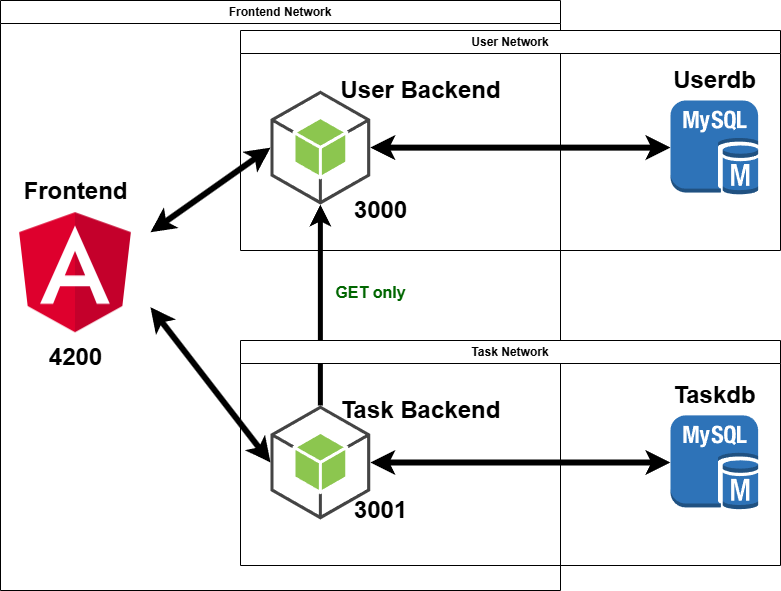

# How RoomieTasks Works

## Architecture Overview

RoomieTasks is built as a modern microservices application with a clear separation of concerns, following industry best practices for scalable web applications. The architecture consists of three main components:

1. **Frontend (Angular)** - User interface and client-side logic
2. **User Service (Node.js/Express)** - Authentication and user management
3. **Task Service (Node.js/Express)** - Task, household and assignment management

This document explains the architecture, design decisions, and implementation details of the RoomieTasks application.



### Detailed Component Architecture

#### Frontend (Angular)

The frontend is structured as follows:

```
Frontend/
├── src/
│   ├── app/
│   │   ├── Components/           # UI Components
│   │   │   ├── Authentication/    # Login/Signup components
│   │   │   ├── BaseComponent/     # Root app component
│   │   │   ├── Dashboard/         # Dashboard views
│   │   │   ├── HomePage/          # Landing page components
│   │   │   ├── Households/        # Household management
│   │   │   ├── StaticPages/       # About, FAQ, etc.
│   │   │   ├── Tasks/             # Task management
│   │   │   └── Utils/             # Shared components (navbar, etc.)
│   │   ├── Config/               # App configuration
│   │   ├── Guards/               # Route guards
│   │   ├── Interceptors/         # HTTP interceptors
│   │   ├── models/               # Data models/interfaces
│   │   └── Services/             # API services
│   ├── environments/             # Environment configurations
│   └── ...                       
└── public/                       # Static assets
```

The Angular application follows a feature-based organization, where related components, services, and models are grouped together. This approach makes the codebase more maintainable as the application grows.

#### User Service (Node.js/Express)

The User Service handles authentication, user profiles, and authorization:

```
Backend-User/
├── src/
│   ├── api/                      # API endpoints
│   │   ├── AuthenticationControllers/  # Auth logic
│   │   ├── auth.ts               # Auth routes
│   │   ├── memberEndpoints.ts    # User profile endpoints
│   │   └── utilityEndpoints.ts   # Utility endpoints
│   ├── ConfigFiles/              # Configuration
│   │   ├── dbAssociations.ts     # Model relationships
│   │   ├── dbConfig.ts           # Database connection
│   │   └── dbUtils.ts            # Database utilities
│   ├── models/                   # Data models
│   │   └── users.ts              # User model
│   ├── types/                    # TypeScript type definitions
│   └── index.ts                  # Service entry point
└── Dockerfile                    # Container definition
```

The User Service uses a RESTful API design with clear endpoint separation based on functionality.

#### Task Service (Node.js/Express)

The Task Service manages households, tasks, and memberships:

```
Backend-Task/
├── src/
│   ├── api/                      # API endpoints
│   │   ├── AuthenticationControllers/  # Token validation
│   │   ├── householdEndpoints.ts # Household management
│   │   ├── taskEndpoints.ts      # Task operations
│   │   └── utilityEndpoints.ts   # Utility endpoints
│   ├── ConfigFiles/              # Configuration
│   │   ├── dbAssociations.ts     # Model relationships
│   │   ├── dbConfig.ts           # Database connection
│   │   └── dbUtils.ts            # Database utilities
│   ├── models/                   # Data models
│   │   ├── households.ts         # Household model
│   │   ├── householdMembers.ts   # Membership model
│   │   ├── tasks.ts              # Task model
│   │   └── users.ts              # User reference model
│   ├── services/                 # External service connections
│   │   └── userService.ts        # Communication with User Service
│   └── index.ts                  # Service entry point
└── Dockerfile                    # Container definition
```

The Task Service architecture mirrors the User Service but with models and endpoints relevant to task management. It maintains a lightweight copy of user data and communicates with the User Service when needed.

## Microservices Architecture

### Why Microservices?

The application uses a microservices architecture rather than a monolithic approach for several key reasons:

1. **Separation of Concerns**: Each service handles a specific domain (users vs. tasks), allowing for focused development and testing.
2. **Independent Scaling**: Services can be scaled independently.
3. **Technology Flexibility**: Different services could potentially use different technologies best suited for their specific needs.
4. **Fault Isolation**: Issues in one service don't necessarily affect others.
5. **Deployment Independence**: Services can be deployed independently, enabling more frequent updates.

### Service Communication

Services communicate through well-defined REST APIs:

- **Frontend → User Service**: Authentication, user profiles
- **Frontend → Task Service**: Task and household management
- **Task Service → User Service**: User verification, profile information

Communication between services is secured using JWT tokens, ensuring that only authenticated requests are processed.

## Frontend Architecture

### Angular Single Page Application

The frontend is an Angular single-page application (SPA) that provides a responsive and intuitive user interface.

Key frontend design choices:

1. **Standalone Components**: Angular standalone components are used throughout, making the application more modular and easier to maintain.
2. **Service-Based Communication**: Services handle all API interactions, providing a clean separation between UI and data access.
3. **Reactive Forms**: Angular's reactive forms are used for all user inputs, enabling robust validation.
4. **Route Guards**: Authentication and role-based guards protect routes from unauthorized access.
5. **Responsive Design**: Bootstrap and custom CSS ensure proper display across devices.

### State Management

The application uses a service-based state management approach:

- **AuthService**: Manages user authentication state
- **HouseholdService**: Handles household data
- **TaskService**: Manages task-related operations
- **MembersService**: Handles user profile modifications

This approach provides adequate state management without introducing the complexity of additional state management libraries like NgRx for this scale of application.

### UI Framework and Components

The UI leverages EasyFrontend templates as a foundation, which were customized and extended with Angular components. This approach allowed for:

1. A professional, consistent UI without extensive custom CSS development
2. Rapid development of complex interfaces
3. Responsive design out of the box

Key UI components include:

- Dashboard views with analytics
- Task calendar
- Household management interfaces
- Form components for creating and editing tasks

## Backend Services

### User Service

The User Service handles authentication and user profile management. It's built with Node.js and Express, using Sequelize as an ORM for database operations.

Key responsibilities:

1. **Authentication**: User registration, login, JWT token generation
2. **Profile Management**: User profile updates
3. **Authorization**: Role-based access control

The service uses bcrypt for password hashing and JWT for secure, stateless authentication.

### Task Service

The Task Service manages all task and household-related operations. It's also built with Node.js, Express, and Sequelize.

Key responsibilities:

1. **Household Management**: Creating, joining, and managing households
2. **Task Operations**: Creating, updating, and tracking tasks
3. **Member Management**: Handling household memberships

The Task Service maintains a lightweight copy of user information for performance reasons while delegating full user management to the User Service.

## Database Architecture

### Separate Databases

Each service has its own dedicated MySQL database:

1. **UserDB**: Stores user accounts and profile information
2. **TaskDB**: Stores households, tasks, and memberships

This separation provides several benefits:

1. **Data Isolation**: Each service owns its data, reducing coupling
2. **Independent Scaling**: Databases can be scaled based on their specific needs
3. **Security**: A compromise in one database doesn't necessarily expose all data

### Database Models

#### User Database

- **Users**: User accounts with authentication and profile information

#### Task Database

- **Users**: Lightweight copy of user information for reference
- **Households**: Household information and ownership
- **HouseholdMembers**: Many-to-many relationship between users and households
- **Tasks**: Task details including assignments and status

### Replication Strategy

The Task Service maintains a lightweight copy of user data from the User Service. This approach:

1. Improves performance by reducing cross-service calls
2. Ensures availability even if the User Service is temporarily unavailable
3. Reduces network overhead for common operations

## Containerization & Deployment

### Docker Implementation

The entire application is containerized using Docker, with separate containers for:

1. Frontend (Angular)
2. User Service
3. Task Service
4. User Database (MySQL)
5. Task Database (MySQL)

#### Docker File Structure

The project includes multiple Docker-related files:

```
RoomieTasks/
├── docker-compose.yml           # Development environment setup
├── Frontend/
│   └── Dockerfile               # Frontend container definition
├── Backend-User/
│   └── Dockerfile               # User service container definition
└── Backend-Task/
│   └── Dockerfile               # Task service container definition
```

### Image Building Process

The Docker images are built in two ways:

1. **Local Development**: `docker-compose build` constructs images directly from source code
2. **CI/CD Pipeline**: GitHub Actions builds and pushes optimized images to Docker Hub


### Network Isolation

The Docker Compose configuration creates three separate networks:

1. **frontend-network**: Connects the frontend to both backend services
2. **user-service-network**: Isolates the User Service and its database
3. **task-service-network**: Isolates the Task Service and its database

This network isolation ensures that:
1. The frontend can only access the public APIs of the services
2. Each service can only access its own database
3. Databases are not directly accessible from outside their network

Network configuration in Docker Compose:
```yaml
networks:
  frontend-network:
    driver: bridge
  user-service-network:
    driver: bridge
  task-service-network:
    driver: bridge
```

Service placement in networks:
- Frontend: frontend-network only
- User Service: frontend-network and user-service-network
- Task Service: frontend-network and task-service-network
- User Database: user-service-network only
- Task Database: task-service-network only

### Data Persistence

Data is persisted using named Docker volumes:

1. **roomietasks-userdb-data**: Stores user database
2. **roomietasks-taskdb-data**: Stores task database

Volume configuration:
```yaml
volumes:
  roomietasks-userdb-data:
    name: roomietasks-userdb-data
  roomietasks-taskdb-data:
    name: roomietasks-taskdb-data
```

These named volumes ensure:
1. Data survives container restarts and host system reboots
2. Volumes can be easily backed up and restored
3. Volumes can be shared between different compose files (dev/prod)

For database initialization, the MySQL containers automatically:
1. Create the specified database if it doesn't exist
2. Use the provided root password
3. Apply default MySQL configuration

The application services use Sequelize to handle schema creation and updates through model synchronization.

## Authentication & Security

### JWT-Based Authentication

The application uses JWT (JSON Web Tokens) for authentication:

1. **Stateless**: No session storage needed on the server
2. **Secure**: Tokens are signed with a secret key
3. **Efficient**: Reduces database lookups for authentication

When a user logs in, the User Service generates a JWT containing the user's ID and role. This token is:

1. Sent to the frontend
2. Stored in localStorage
3. Included in all subsequent API requests via an interceptor

### Role-Based Authorization

The application implements role-based access control:

1. **Regular Users**: Can join households, manage tasks
2. **Household Owners**: Can manage household settings, invite codes
3. **Admins**: Have system-wide administrative privileges

Authorization is enforced at multiple levels:

1. **Frontend**: Route guards prevent unauthorized access to protected routes
2. **Backend**: Middleware verifies roles before allowing access to protected endpoints

## Key Features Implementation

### Household Management

Households are the core organizational unit, allowing users to:

1. **Create Households**: Users can create new households they own
2. **Join Via Invite Code**: Users can join existing households with an invite code
3. **Manage Memberships**: Owners can generate new invite codes or remove members

Implementation details:

- Unique invite codes are generated using UUID v4 (truncated)
- Households have a many-to-many relationship with users through the HouseholdMember model
- Ownership is tracked separately to control administrative actions

### Task Assignment and Tracking

Tasks represent household chores with key features:

1. **Assignment**: Tasks can be assigned to any household member
2. **Due Dates**: Tasks have deadlines for completion
3. **Priorities**: Tasks can be marked as low, medium, or high priority
4. **Recurring Tasks**: Tasks can repeat daily, weekly, or monthly

When a recurring task is completed:

1. The current task is marked as completed
2. A new task is automatically created for the next occurrence
3. The new task inherits all properties except the due date

### Calendar View

The calendar provides a visual representation of upcoming tasks:

1. Monthly view with task indicators on each day
2. Color-coding based on task priority
3. Icons indicating recurring tasks
4. Clickable tasks for detailed view

Implementation uses a custom grid-based calendar rather than a third-party component, ensuring full control over the presentation and interaction.

### Analytics Dashboard

The analytics dashboard provides insights into household task distribution:

1. Completion rates and statistics
2. Task distribution by priority and status
3. User contribution metrics

Implementation uses SVG-based visualizations drawn directly in the component, avoiding additional dependencies for simple charts.

## Development Workflow

### Local Development

For local development, the project uses Docker Compose to spin up all services together:

1. Frontend with hot-reload for rapid development
2. Backend services with automatic restart on code changes
3. Pre-configured databases with persistent volumes

This approach ensures that developers can quickly start working with a complete environment without complex setup procedures.

## CI/CD Implementation

The RoomieTasks project employs a comprehensive Continuous Integration and Continuous Deployment (CI/CD) pipeline using GitHub Actions. This pipeline automates the build, test, and deployment processes, ensuring consistency and reliability.

### CI/CD Workflow

The complete CI/CD workflow consists of these key stages:

1. **Code Validation**
   - Linting TypeScript files
   - Code format checking
   - Static analysis
   - Security scanning of dependencies

2. **Testing**
   - Unit tests for frontend components
   - Unit tests for backend services
   - Integration tests
   - End-to-end tests (when applicable)

3. **Building**
   - Building frontend (Angular)
   - Building backend services (Node.js/TypeScript)
   - Creating optimized Docker images
   - Tagging images with version and commit hash

4. **Deployment**
   - Pushing images to Docker Hub
   - Updating deployment configurations
   - Triggering deployments to target environments

### GitHub Actions Configuration

The CI/CD pipeline is defined in `.github/workflows/` directory with the following key workflows:

#### Main Build and Deploy Workflow

```yaml
name: Build and Deploy

on:
  push:
    branches: [ main ]
    tags: [ 'v*' ]
  pull_request:
    branches: [ main ]

jobs:
  lint:
    runs-on: ubuntu-latest
    steps:
      - uses: actions/checkout@v3
      - name: Set up Node.js
        uses: actions/setup-node@v3
        with:
          node-version: '18'
      - name: Install dependencies
        run: npm ci
      - name: Run linters
        run: npm run lint

  test:
    needs: lint
    runs-on: ubuntu-latest
    steps:
      - uses: actions/checkout@v3
      - name: Set up Node.js
        uses: actions/setup-node@v3
        with:
          node-version: '18'
      - name: Install dependencies
        run: npm ci
      - name: Run tests
        run: npm test

  build:
    needs: test
    runs-on: ubuntu-latest
    steps:
      - uses: actions/checkout@v3
      
      - name: Log in to Docker Hub
        uses: docker/login-action@v2
        with:
          username: ${{ secrets.DOCKER_USERNAME }}
          password: ${{ secrets.DOCKER_PASSWORD }}
      
      - name: Extract metadata
        id: meta
        uses: docker/metadata-action@v4
        with:
          images: ${{ secrets.DOCKER_USERNAME }}/roomietasks
          tags: |
            type=semver,pattern={{version}}
            type=ref,event=branch
            type=sha,format=short
      
      - name: Build and push Frontend
        uses: docker/build-push-action@v4
        with:
          context: ./Frontend
          push: ${{ github.event_name != 'pull_request' }}
          tags: ${{ steps.meta.outputs.tags }}-frontend
          labels: ${{ steps.meta.outputs.labels }}
      
      - name: Build and push User Service
        uses: docker/build-push-action@v4
        with:
          context: ./Backend-User
          push: ${{ github.event_name != 'pull_request' }}
          tags: ${{ steps.meta.outputs.tags }}-user-service
          labels: ${{ steps.meta.outputs.labels }}
      
      - name: Build and push Task Service
        uses: docker/build-push-action@v4
        with:
          context: ./Backend-Task
          push: ${{ github.event_name != 'pull_request' }}
          tags: ${{ steps.meta.outputs.tags }}-task-service
          labels: ${{ steps.meta.outputs.labels }}

  deploy:
    needs: build
    if: startsWith(github.ref, 'refs/tags/')
    runs-on: ubuntu-latest
    steps:
      - uses: actions/checkout@v3
      
      - name: Deploy to production
        uses: appleboy/ssh-action@master
        with:
          host: ${{ secrets.DEPLOY_HOST }}
          username: ${{ secrets.DEPLOY_USER }}
          key: ${{ secrets.DEPLOY_KEY }}
          script: |
            cd /opt/roomietasks
            docker-compose -f docker-compose.deploy.yml pull
            docker-compose -f docker-compose.deploy.yml up -d
```

### Docker Image Management

Docker images are built and managed in the CI/CD pipeline using these strategies:

1. **Versioning**: 
   - Semantic versioning (v1.0.0, v1.1.0, etc.) for release tags
   - Branch name for development branches
   - Short commit SHA for precise identification

2. **Image Layers**:
   - Optimized layer caching for faster builds
   - Multi-stage builds to minimize final image size
   - Dependency layers separated from code layers for efficient rebuilds

3. **Security Scanning**:
   - Container images are scanned for vulnerabilities
   - Base images are regularly updated
   - Dependencies are checked for security issues

## Design Decisions and Trade-offs

### Why Angular?

Angular was chosen for the frontend because:

1. **Type Safety**: TypeScript provides better type checking and IDE support
2. **Comprehensive Framework**: Includes routing, forms, HTTP client, etc.
3. **Component Architecture**: Promotes reusable, maintainable code
4. **Enterprise Ready**: Well-suited for larger applications with multiple developers

The trade-off is a steeper learning curve and slightly more boilerplate compared to React or Vue.

### Why Node.js for Backend?

Node.js was selected for the backend services because:

1. **JavaScript Everywhere**: Enables sharing code and types between frontend and backend
2. **Non-Blocking I/O**: Efficiently handles many concurrent connections
3. **Rich Ecosystem**: Large number of libraries and tools
4. **Developer Familiarity**: Same language as the frontend reduces context switching

The trade-off is that Node.js may not be as performant for CPU-intensive operations compared to languages like Go or Rust.

### Why MySQL?

MySQL was chosen as the database because:

1. **Relational Model**: Well-suited for the structured data in the application
2. **Widespread Adoption**: Well-understood, with plenty of documentation and support
3. **Sequelize Support**: Good ORM support in Node.js
4. **Containerization**: Easy to containerize and deploy

### Microservices vs. Monolith

A microservices architecture was chosen despite the increased complexity because:

1. **Scalability**: Services can be scaled independently
2. **Team Organization**: Allows teams to work on different services independently
3. **Technology Evolution**: Services can be updated or replaced individually
4. **Learning Value**: Demonstrates practical microservices patterns

For a smaller application, a monolithic architecture might have been simpler and adequate, but the microservices approach provides better scalability and team workflow for larger applications.

## Conclusion

RoomieTasks demonstrates a modern approach to web application development, incorporating microservices, containerization, and responsive UI design. The architecture balances complexity with maintainability, providing a solid foundation for future growth and enhancements.

By separating concerns between services, implementing proper security measures, and following best practices for deployment, the application achieves both technical excellence and practical utility for its intended purpose of simplifying household management.